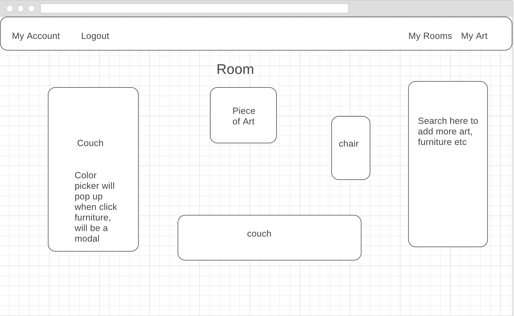

### apARTment

Our project is a room decorator pulling from the Rijks Museum API to grab art from their 
database to save to the users collection. By logging in, the user can see all of the 
art in their gallery and can append it to their room. Then, with a color picker
generated from the database, the user can add their choice of furniture to a room and
color it from the color pallet.

---
### Pages

* Landing login page
* Profile page
* Gallery page
* Rooms page
* Room with art page
* Search page 

---
### Technologies Used

* HTML
* CSS
* Javascript
* Coffeescript 
* Ruby on Rails 
* Rijks Museum API
* Inline SVG gem
* Devise 
* HTTParty

---
### Approach Taken

We began wireframing each individual code. Then, our first priority was working with
our API to make complete calls to the database. Then, more Coffeescript was done for 
the color picker and room generator. 

---
### Installation Instructions
In order to interact with the website, the user must have a login. Create a login and
then you are brought to you profile page with your art and rooms. There, you can
add art and rooms to your account, which will appear on the front page (the profile page). 

---
### Wireframes

